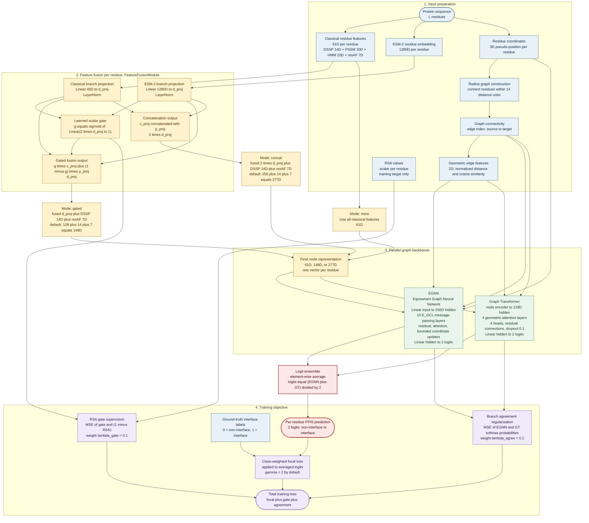

# GTE-PPIS Model Architecture

This diagram follows the active `FinalModel.forward()` path and the training losses used by `train.py`.

### Component definitions

| Component | Definition | Implementation |
|---|---|---|
| DSSP | Per-residue secondary-structure and solvent-related descriptors. | `data_generator.py::get_node_features()` |
| PSSM | Position-specific scoring matrix encoding evolutionary conservation. | `data_generator.py::get_node_features()` |
| HMM | Profile-HMM residue features encoding sequence-family information. | `data_generator.py::get_node_features()` |
| resAF | Residue atom-feature descriptors. | `data_generator.py::get_node_features()` |
| ESM-2 | Protein language-model embedding with 1280 values per residue. | `data_generator.py::ProDataset.__getitem__()` |
| Radius graph | Structural residue graph containing edges for residue pairs within the configured cutoff. | `data_generator.py::cal_edges()` |
| E-GCL | EGNN layer that updates edge messages, node states, and coordinates. | `EGNN_model.py::E_GCL` |
| EGNN | Equivariant graph branch using 10 E-GCL layers and 2-class output logits. | `EGNN_model.py::EGNN` |
| Graph Transformer | Multi-head geometric attention branch using node and edge representations. | `GraphTransformer_Block.py::GraghTransformer` |
| FeatureFusionModule | Projects classical and ESM-2 features into a shared space, then gates or concatenates them. | `fusion_module.py::FeatureFusionModule` |
| RSA supervision | Uses relative solvent accessibility to target the gate with `1 - RSA`. | `final_model.py::compute_auxiliary_losses()` |
| Branch agreement | Penalizes disagreement between the EGNN and Graph Transformer probabilities. | `final_model.py::compute_auxiliary_losses()` |

## Runtime variants

- `--fusion_mode none`: classical 61D node features; ESM-2 is bypassed.
- `--fusion_mode gated`: learned scalar gate mixes projected classical and ESM-2 features. This is the full proposed path and the default architecture shown above when fusion is enabled.
- `--fusion_mode concat`: projected classical and ESM-2 features are concatenated instead of gated.

The dataset also prepares an adjacency matrix and `edge_att`, but the current `FinalModel.forward()` uses `node_features`, `xyz_feats`, `edges`, and `edge_feat` for its two active branches. RSA values are used as auxiliary gate targets, not as prediction inputs.
