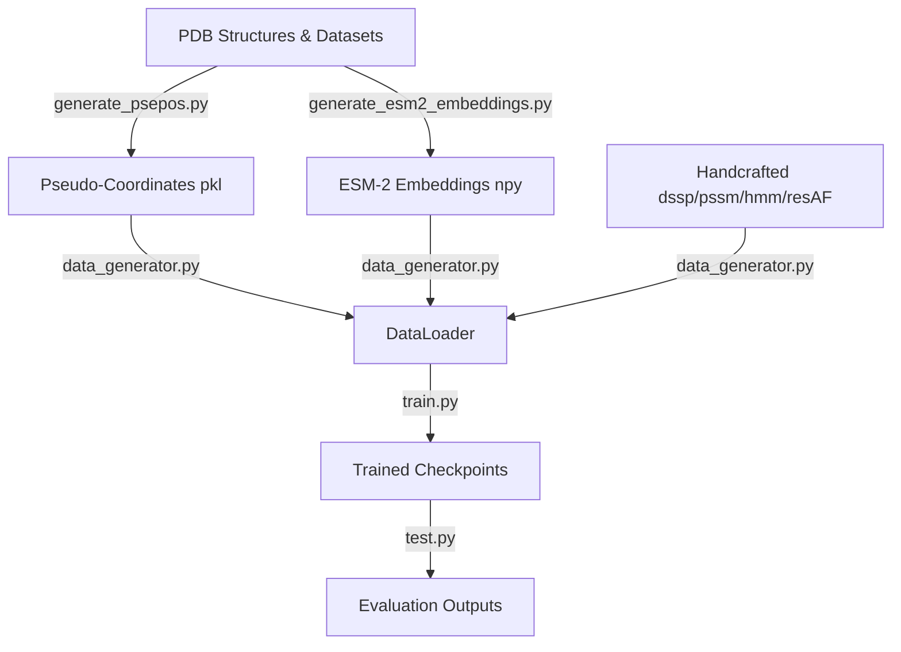
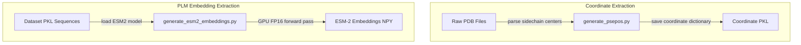
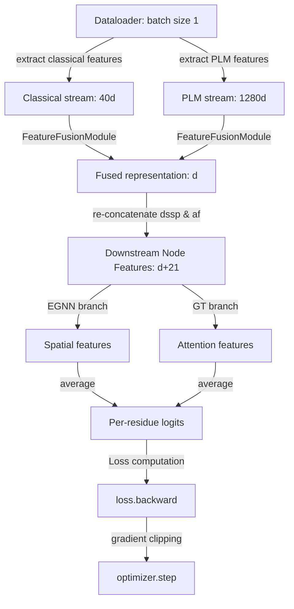
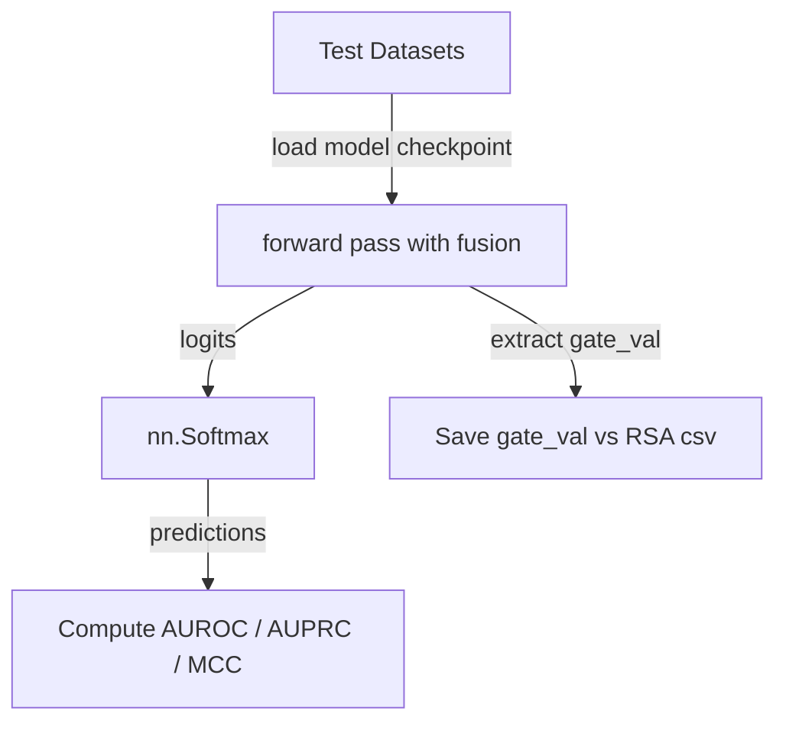
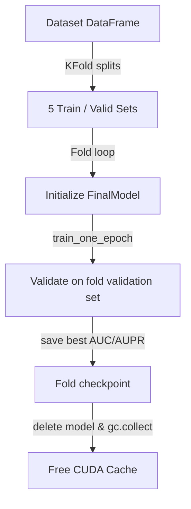
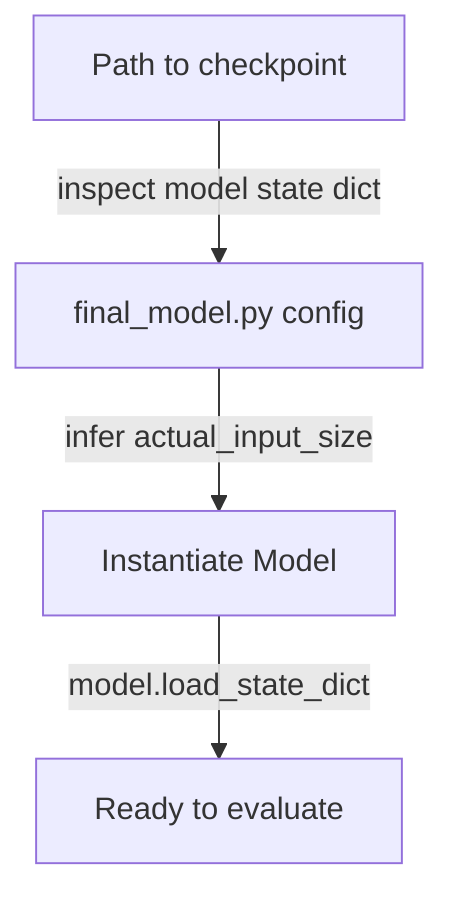

# GTE-PPIS Feature Fusion Module (FFM) Evaluation Guide

This document serves as a complete execution and architectural guide for the Feature Fusion Module (FFM) pipeline implemented in the GTE-PPIS model. It details the purpose of each codebase file, provides flowcharts for all pipeline stages, and documents known reproducibility discrepancies.

---

## 1. File-by-File Specification

This section documents the role of every primary source code file in the repository, specifying its inputs, outputs, when it is invoked, and its pipeline context.

### [train.py](file:///home/pranav/GTE-PPIS/train.py)
*   **Purpose**: Coordinates the 5-fold cross-validation and full-dataset training routines.
*   **Inputs**: Classical protein features from `./Dataset/Train_335.pkl` and cached ESM-2 embeddings from `./Feature/esm2/`.
*   **Outputs**: Saves fold checkpoints (`Fold[1-5]_best_model.pkl`) and the final model (`Full_model_[aver_epoch].pkl`) under `./Log/fusion_<mode>_d<d_proj>_<timestamp>/model/`, and execution logs to `training.log`.
*   **Pipeline Context**: Entrypoint for training. Parses CLI flags, partitions the training dataset into folds, initializes the `FinalModel`, and runs the optimizer loop.

### [test.py](file:///home/pranav/GTE-PPIS/test.py)
*   **Purpose**: Runs model evaluation across the test datasets.
*   **Inputs**: Dataset files (`Test_60.pkl`, `Test_315-28.pkl`, `UBtest_31-6.pkl`), ESM-2 embeddings, and a directory containing trained model checkpoints.
*   **Outputs**: Logs performance metrics (binary accuracy, precision, recall, F1, AUROC, AUPRC, MCC) to stdout. In `gated` mode, saves a `<checkpoint_name>_gate_records.csv` file mapping gate values to ground truth sites and DSSP relative solvent accessibility (RSA).
*   **Pipeline Context**: Entrypoint for testing. Evaluates generalization performance and collects gating behavior metrics.

### [final_model.py](file:///home/pranav/GTE-PPIS/final_model.py)
*   **Purpose**: Defines the `FinalModel` class that ties together the FFM and GNN branches.
*   **Inputs**: Batched residue features, coordinates, edge attributes, adjacency matrix, and ESM-2 features.
*   **Outputs**: Per-residue binding probability logits.
*   **Pipeline Context**: Acts as the model container. Instantiates the `FeatureFusionModule`, `EGNN`, and `GraghTransformer`, runs the forward pass, and computes the Cross Entropy loss.

### [fusion_module.py](file:///home/pranav/GTE-PPIS/fusion_module.py)
*   **Purpose**: Implements the `FeatureFusionModule` featuring the learned projection and fusion operators (`none`, `concat`, `gated`, `cross_attn`).
*   **Inputs**: Classical handcrafted features (PSSM + HMM, 40d) and ESM-2 features (1280d).
*   **Outputs**: Returns a fused representation of dimension $d$ (or $2d$ for `concat`) and gate scalars `gate_val` for gated mode.
*   **Pipeline Context**: Invoked at the beginning of the `FinalModel.forward` pass, transforming raw evolutionary features before they enter the GNNs.

### [EGNN_model.py](file:///home/pranav/GTE-PPIS/EGNN_model.py)
*   **Purpose**: Defines the Equivariant Graph Convolutional Network (`EGNN`) and its constituent message-passing layers (`E_GCL`).
*   **Inputs**: Node features, coordinates, edge connections, and edge features.
*   **Outputs**: Node representation embeddings.
*   **Pipeline Context**: One of the two parallel downstream branches in `FinalModel`. Learns coordinate-aware spatial representations.

### [GraphTransformer_Block.py](file:///home/pranav/GTE-PPIS/GraphTransformer_Block.py)
*   **Purpose**: Implements the parallel Graph Transformer (`GraghTransformer`) branch.
*   **Inputs**: Node features, edge connections, and edge features.
*   **Outputs**: Node representation embeddings.
*   **Pipeline Context**: Evaluated in parallel with `EGNN` in `FinalModel`. Captures global topological context via attention.

### [data_generator.py](file:///home/pranav/GTE-PPIS/data_generator.py)
*   **Purpose**: Implements dataset loaders (`ProDataset`), collate functions (`graph_collate`), and feature parsing helper functions (`get_node_features`).
*   **Inputs**: Raw NumPy feature files from `./Feature/dssp/`, `./Feature/pssm/`, `./Feature/hmm/`, `./Feature/resAF/`, and `./Feature/esm2/`.
*   **Outputs**: Batched PyTorch variables ready for GNN consumption.
*   **Pipeline Context**: Coordinates the ETL pipeline, loading features dynamically during training/testing.

### [generate_esm2_embeddings.py](file:///home/pranav/GTE-PPIS/generate_esm2_embeddings.py)
*   **Purpose**: Extracts per-residue embeddings from the pre-trained `facebook/esm2_t33_650M_UR50D` model.
*   **Inputs**: FASTA-like datasets (`Train_335.pkl`, etc.).
*   **Outputs**: Saves extracted embeddings as float16 `.npy` files to `./Feature/esm2/`.
*   **Pipeline Context**: Pre-processing asset generation script. Must be run before executing any PLM experiments.

### [generate_psepos.py](file:///home/pranav/GTE-PPIS/generate_psepos.py)
*   **Purpose**: Extracts pseudo-coordinates (psepos) from raw PDB files.
*   **Inputs**: Raw PDB structures stored in the `./PDB/` folder.
*   **Outputs**: Pickled coordinates maps (`Train335_psepos_SC.pkl`, etc.) under `./Feature/psepos/`.
*   **Pipeline Context**: Pre-processing asset generation script. Extracts starting 3D spatial coordinate vectors.

### [run_experiments.sh](file:///home/pranav/GTE-PPIS/run_experiments.sh)
*   **Purpose**: Automates the execution of experiments across all modes.
*   **Inputs**: Configuration settings and parameters.
*   **Outputs**: Sequential run logs and test summaries.
*   **Pipeline Context**: Orchestrator script to run baseline and FFM experiments sequentially.

---

## 2. Pipeline Flowcharts

The following flowcharts detail the lifecycle and data flows of the repository components.

### 1. Complete Repository Flow


### 2. Feature Generation Flow


### 3. Training Flow


### 4. Testing Flow


### 5. Cross-Validation Flow


### 6. Checkpoint Loading Flow


---

## 3. Known Discrepancies and Instabilities

### Verified Issues
1.  **Gated Mode Instability (Blocked)**:
    *   **Finding**: Full training of the `gated` fusion model results in coordinate and feature scale explosion during evaluation. The values of $h$ and $x$ grow exponentially starting at layer 4 (where coordinate values jump from $\sim 70.8$ to $\sim 898.6$ and continue scaling to over $10^{21}$ at layer 7), resulting in `NaN` outputs in layer 8 of the `EGNN` branch.
    *   **Root Cause**: The downstream 10-layer `EGNN` is configured with `residual=False`, `tanh=False` (unbounded coordinate updates), and lacks BatchNorm/LayerNorm layers. Feature shifts from the gated fusion module are recursively amplified across GNN layers.

### Remaining Issues
*   The gated fusion mode requires architectural adjustments in the downstream GNN branches to stabilize training over the full dataset.

### Assumptions and Risks
*   **Downstream Architecture Immutability**: FFM research assumes the downstream GNN models must not be changed. However, because `EGNN` lacks structural normalization, some fusion modes (such as gating) are mathematically blocked from training without GNN modifications.
*   **VRAM Constraints**: Loading ESM-2 embeddings dynamically requires sufficient RAM and page caches to prevent dataloader thread starvation when multiple workers are configured.

---

## 4. Execution Commands Reference

### Baseline Mode
```bash
./venv/bin/python train.py --fusion_mode none
```

### Concat Mode
```bash
./venv/bin/python train.py --fusion_mode concat --d_proj 128
```

### Attention Mode
```bash
./venv/bin/python train.py --fusion_mode cross_attn --d_proj 128
```

### Gated Mode (Blocked - For testing only)
```bash
./venv/bin/python train.py --fusion_mode gated --d_proj 128
```
